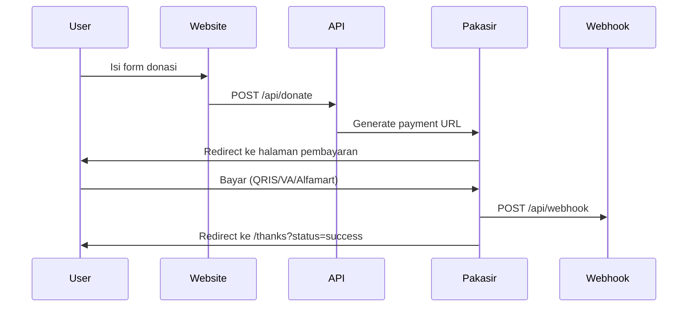

# YoSawer 🥤

Personal donation gateway buat kreator Indonesia.  
Pakai **Next.js 15 + ShadCN UI + Pakasir** → bisa terima **QRIS, Virtual Account, Alfamart/Indomaret, bahkan PayPal** dalam satu klik.  
Tanpa ribet, tanpa biaya bulanan, dana langsung masuk rekening lu.

---

## ✨ Fitur

- 🎨 **UI Modern** - Desain seperti Xendit, clean & professional
- 💰 **Quick Amount Buttons** - Pilih nominal cepat (Rp 10K, 25K, 50K, 100K, 250K)
- 💳 **Auto Format Currency** - Input otomatis format dengan thousand separator (50.000)
- ✅ **Status Handling** - Support success, pending, dan failed payment
- 🎯 **SEO Optimized** - Open Graph & Twitter Cards untuk social sharing
- ♿ **Accessibility** - ARIA labels dan keyboard navigation
- 📱 **Responsive Design** - Mobile-friendly dengan grid yang adaptif
- 🛡️ **Error Handling** - Validasi lengkap dengan pesan error yang jelas
- 🔔 **Webhook Support** - Auto verification payment via webhook

---

🔗 **Demo:** [https://yosawer.vercel.app](https://yosawer.vercel.app)  
⭐ **Dapatkan bintang gratis** → klik ⭐ di repo ini kalau berguna

---

## 🚀 Quick Start

### Deploy 1-Klik ke Vercel

[](https://vercel.com/new/clone?repository-url=https://github.com/AhzamyCode/yosawer&env=NEXT_PUBLIC_PAKASIR_SLUG,PAKASIR_API_KEY,NEXT_PUBLIC_REDIRECT_URL)

**Tahapan Deploy:**
1. Klik tombol deploy di atas
2. Connect GitHub account
3. Isi Environment Variables (lihat bagian Environment Variables)
4. Deploy!

---

## 📦 Install Lokal (Step by Step)

### Prerequisites

- Node.js 18+ (disarankan 20+)
- npm atau yarn atau pnpm
- Akun Pakasir (gratis di [app.pakasir.com](https://app.pakasir.com))

### Tahap 1: Clone Repository

```bash
git clone https://github.com/AhzamyCode/yosawer.git
cd yosawer
```

### Tahap 2: Install Dependencies

```bash
npm install
# atau
yarn install
# atau
pnpm install
```

### Tahap 3: Setup Environment Variables

Buat file `.env.local` di root project (copy dari `.env.example` jika ada):

```bash
# Pakasir Configuration
NEXT_PUBLIC_PAKASIR_SLUG=your_project_slug
PAKASIR_API_KEY=your_api_key
NEXT_PUBLIC_REDIRECT_URL=http://localhost:3000/thanks

# Untuk production, ganti dengan:
# NEXT_PUBLIC_REDIRECT_URL=https://yourdomain.com/thanks
```

**Cara Dapetin Environment Variables:**

1. **Daftar/Login** ke [https://app.pakasir.com](https://app.pakasir.com)
2. **Buat Proyek Baru** di dashboard
3. **Copy Project Slug** dari pengaturan proyek
4. **Copy API Key** dari pengaturan proyek
5. **Set Webhook URL** di pengaturan proyek:
   - Development: `http://localhost:3000/api/webhook` (pakai ngrok untuk test)
   - Production: `https://yourdomain.com/api/webhook`

### Tahap 4: Jalankan Development Server

```bash
npm run dev
# atau
yarn dev
# atau
pnpm dev
```

### Tahap 5: Buka di Browser

Buka [http://localhost:3000](http://localhost:3000)

---

## 🗂️ Struktur Project

```
yosawer/
├── app/
│   ├── api/
│   │   ├── donate/
│   │   │   └── route.ts          # API endpoint untuk membuat payment URL
│   │   └── webhook/
│   │       └── route.ts          # Webhook endpoint untuk menerima notifikasi
│   ├── thanks/
│   │   └── page.tsx              # Halaman terima kasih (success/pending/failed)
│   ├── layout.tsx                # Root layout dengan metadata SEO
│   ├── page.tsx                  # Halaman utama dengan form donasi
│   └── globals.css               # Global styles & theme
├── components/
│   ├── DonationForm.tsx          # Form donasi dengan quick amount buttons
│   └── ui/                       # Komponen ShadCN UI
│       ├── button.tsx
│       ├── card.tsx
│       ├── input.tsx
│       ├── label.tsx
│       └── textarea.tsx
├── lib/
│   └── utils.ts                  # Utility functions (currency formatter, dll)
├── public/                       # Static files
├── next.config.ts                # Next.js configuration
├── package.json                  # Dependencies
└── README.md                     # Dokumentasi ini
```

---

## 🔑 Mendapatkan API Key Pakasir

### Step 1: Daftar Akun

1. Buka [https://app.pakasir.com](https://app.pakasir.com)
2. Klik **"Daftar"** atau **"Login"** jika sudah punya akun
3. Verifikasi email jika diperlukan

### Step 2: Buat Proyek

1. Setelah login, klik **"Buat Proyek Baru"**
2. Isi nama proyek (contoh: "YoSawer Donation")
3. Pilih kategori (opsional)
4. Klik **"Buat"**

### Step 3: Ambil Credentials

1. Masuk ke **"Pengaturan Proyek"**
2. **Copy Project Slug** → masukkan ke `NEXT_PUBLIC_PAKASIR_SLUG`
3. **Copy API Key** → masukkan ke `PAKASIR_API_KEY`
4. **Set Webhook URL** → masukkan `https://yourdomain.com/api/webhook`

### Step 4: Aktifkan Sandbox (Untuk Testing)

1. Di dashboard proyek, aktifkan **"Mode Sandbox"**
2. Minimal donasi di sandbox: **Rp 2.000**
3. Gunakan **"Simulasi Pembayaran"** untuk test webhook

---

## 🔁 Alur Kerja

### Alur Donasi



**Detail Alur:**

1. **User mengisi form donasi**
   - Pilih nominal cepat atau masukkan custom amount
   - Isi nama (opsional)
   - Isi pesan (opsional)
   - Klik "Lanjutkan Donasi"

2. **Sistem membuat payment URL**
   - Generate `order_id` dengan format `YSW-{timestamp}`
   - Validasi amount (min Rp 2.000)
   - Request payment URL ke Pakasir
   - Redirect ke halaman pembayaran Pakasir

3. **User melakukan pembayaran**
   - Pilih metode pembayaran (QRIS, VA, Alfamart, dll)
   - Bayar sesuai instruksi
   - Tunggu konfirmasi

4. **Webhook menerima notifikasi**
   - Pakasir mengirim POST request ke `/api/webhook`
   - Sistem memverifikasi dan memproses pembayaran
   - Simpan ke database (jika ada) - TODO

5. **User di-redirect ke halaman thanks**
   - Success: `/thanks?status=success&amount=50000&order_id=YSW-...`
   - Pending: `/thanks?status=pending&amount=50000`
   - Failed: `/thanks?status=failed`

---

## 📝 Environment Variables

### Wajib Diisi

| Variable | Deskripsi | Contoh |
|----------|-----------|--------|
| `NEXT_PUBLIC_PAKASIR_SLUG` | Project Slug dari Pakasir | `my-donation-project` |
| `PAKASIR_API_KEY` | API Key dari Pakasir | `pk_xxxxxxxxxxxxx` |
| `NEXT_PUBLIC_REDIRECT_URL` | URL redirect setelah pembayaran | `https://yourdomain.com/thanks` |

### Contoh .env.local

```env
# Development
NEXT_PUBLIC_PAKASIR_SLUG=my-donation-project
PAKASIR_API_KEY=pk_test_xxxxxxxxxxxxx
NEXT_PUBLIC_REDIRECT_URL=http://localhost:3000/thanks

# Production
# NEXT_PUBLIC_PAKASIR_SLUG=my-donation-project
# PAKASIR_API_KEY=pk_live_xxxxxxxxxxxxx
# NEXT_PUBLIC_REDIRECT_URL=https://yourdomain.com/thanks
```

---

## 🧪 Testing

### Mode Sandbox

1. **Aktifkan Sandbox** di dashboard Pakasir
2. **Minimal donasi**: Rp 2.000 (untuk testing)
3. **Test Flow:**
   - Isi form donasi di localhost
   - Pilih metode pembayaran sandbox
   - Gunakan **"Simulasi Pembayaran"** di dashboard
   - Cek webhook di console/logs

### Test Webhook Lokal

Untuk test webhook di localhost, gunakan **ngrok**:

```bash
# Install ngrok
npm install -g ngrok

# Jalankan ngrok
ngrok http 3000

# Copy URL ngrok (contoh: https://abc123.ngrok.io)
# Set Webhook URL di Pakasir: https://abc123.ngrok.io/api/webhook
```

---

## 🎨 Kustomisasi

### Mengubah Judul & Deskripsi

**File:** `app/page.tsx`

```tsx
<h1>YoSawer - Support Gua!</h1>
<p>Kalo lo suka konten gua, bisa dikasih sawer disini...</p>
```

### Mengubah Quick Amount Buttons

**File:** `components/DonationForm.tsx`

```tsx
const QUICK_AMOUNTS = [10000, 25000, 50000, 100000, 250000];
// Ubah sesuai kebutuhan
```

### Mengubah Minimum Donasi

**File:** `app/api/donate/route.ts`

```tsx
if (Number(amount) < 2000) { // Ubah 2000 ke nominal lain
  return NextResponse.json(
    { error: "Minimum donasi adalah Rp 2.000" },
    { status: 400 }
  );
}
```

### Mengubah Warna & Theme

**File:** `app/globals.css`

Edit CSS variables di `:root` untuk mengubah warna primary, background, dll.

### Mengubah Pesan Thanks Page

**File:** `app/thanks/page.tsx`

Edit message untuk status success, pending, atau failed.

---

## 📊 Webhook Payload

Pakasir akan mengirim POST request ke `/api/webhook` dengan format:

```json
{
  "amount": 75000,
  "order_id": "YSW-1712345678900",
  "project": "your_slug",
  "status": "completed",
  "payment_method": "qris",
  "completed_at": "2024-09-10T08:07:02.819+07:00"
}
```

### Handle Webhook (TODO - Implement sesuai kebutuhan)

**File:** `app/api/webhook/route.ts`

Contoh implementasi:

```typescript
// Simpan ke database
await db.donations.create({
  data: {
    order_id: body.order_id,
    amount: body.amount,
    status: body.status,
    payment_method: body.payment_method,
    completed_at: body.completed_at,
  }
});

// Kirim notifikasi (email, Telegram, dll)
if (body.status === "completed") {
  await sendNotification({
    amount: body.amount,
    order_id: body.order_id,
  });
}
```

---

## 🐛 Troubleshooting

### Error: "Konfigurasi server tidak lengkap"

**Solusi:** Pastikan semua environment variables sudah diisi di `.env.local`

### Error: "Minimum donasi adalah Rp 2.000"

**Solusi:** Minimum donasi adalah Rp 2.000. Jika ingin mengubah, edit `app/api/donate/route.ts`

### Webhook tidak menerima notifikasi

**Solusi:**
1. Pastikan Webhook URL sudah di-set di dashboard Pakasir
2. Untuk localhost, gunakan ngrok
3. Cek logs di console untuk error

### Error saat build: "Module not found"

**Solusi:**
```bash
# Hapus node_modules dan install ulang
rm -rf node_modules package-lock.json
npm install
```

### Styling tidak muncul

**Solusi:**
```bash
# Restart dev server
npm run dev
```

---

## 📦 Scripts

```bash
# Development
npm run dev          # Jalankan dev server (localhost:3000)

# Production
npm run build        # Build untuk production
npm run start        # Jalankan production server

# Lainnya
npm run lint         # Lint code (jika ada)
```

---

## 🔒 Security

- ✅ Environment variables tidak di-commit ke git
- ✅ Input validation di API routes
- ✅ Webhook signature verification (TODO - implement jika Pakasir support)
- ✅ Error handling dengan try-catch
- ✅ XSS protection via Next.js default

---

## 📄 Lisensi

MIT License - fork, jual, modifikasi silahkan. Tapi kalau bisa kasih ⭐ ya!

---

## 💬 Butuh Bantuan?

- 📧 **Open Issue** di GitHub
- 🐦 **Mention** [@AhzamyCode](https://twitter.com/AhzamyCode)
- 📖 **Baca Docs** Pakasir: [https://docs.pakasir.com](https://docs.pakasir.com)

---

## 🙏 Credits

- **Next.js** - React Framework
- **ShadCN UI** - UI Components
- **Pakasir** - Payment Gateway
- **Lucide Icons** - Icons

---

## ☕ Support Project Ini

Kalau lu suka proyek ini atau pengen support biar terus berkembang ☕

Silakan donasi lewat QRIS berikut:  
👉 [https://qris.zone.id/ahzamycode](https://qris.zone.id/ahzamycode)

---

**Kalau repo ini membantu, jangan lupa kasih ⭐ ya!** 🚀
